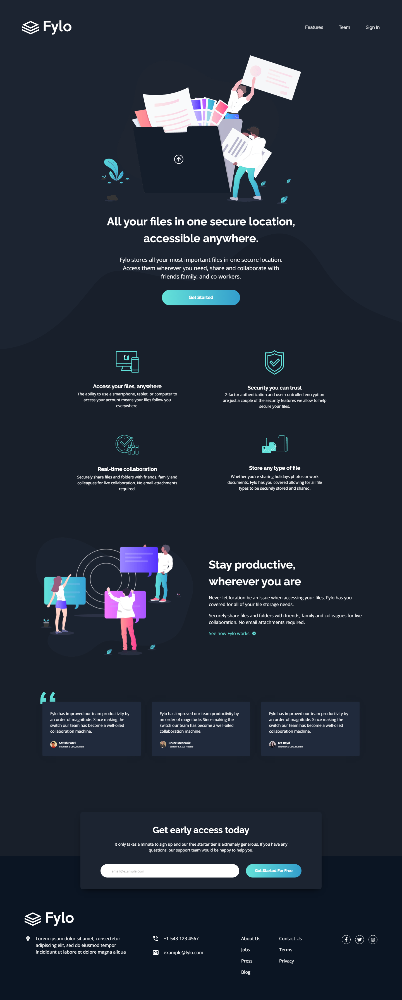

# Frontend Mentor - Fylo dark theme landing page solution

This is a solution to the [Fylo dark theme landing page challenge on Frontend Mentor](https://www.frontendmentor.io/challenges/fylo-dark-theme-landing-page-5ca5f2d21e82137ec91a50fd). Frontend Mentor challenges help you improve your coding skills by building realistic projects. 

## Table of contents

- [Overview](#overview)
  - [The challenge](#the-challenge)
  - [Screenshot](#screenshot)
  - [Links](#links)
- [My process](#my-process)
  - [Built with](#built-with)
  - [What I learned](#what-i-learned)
  - [Continued development](#continued-development)
  - [Useful resources](#useful-resources)
- [Author](#author)

## Overview

### The challenge

Users should be able to:

- View the optimal layout for the site depending on their device's screen size
- See hover states for all interactive elements on the page

### Screenshot



### Links

- HTML solution URL: [HTML](https://github.com/JustANipple/fylo-dark-theme-landing-page/blob/master/index.html)
- SCSS solution URL: [SCSS](https://github.com/JustANipple/fylo-dark-theme-landing-page/blob/master/styles/style.scss)
- JS solution URL: [JS](https://github.com/JustANipple/fylo-dark-theme-landing-page/blob/master/scripts/script.js)
- Live Site URL: [LIVE](https://justanipple.github.io/fylo-dark-theme-landing-page/)

## My process

### Built with

- Semantic HTML5 markup
- CSS custom properties
- Flexbox
- CSS Grid
- Mobile-first workflow
- Sass
- JavaScript

### What I learned

#### Sass

I've made this challenge before, so to make it more challenging, i decided to try using a pre-processor, Sass.
The nesting functionality of the pre-processor made it easier to organize my code
I managed to split custom properties, CSS reset and desktop view parts into different stylesheets and then i imported them into the main SCSS with the "@use" rule

Imported components:
```scss
@use "reset";
@use "customProperties";
@use "desktopView";
```

### Continued development

I'm realizing that every challenge often takes components that i used already, so it would be nice to learn building a custom library with my own components to make it faster and easier to build a site from scratch

### Useful resources

- [Sass setup](https://www.freecodecamp.org/news/the-beginners-guide-to-sass/) - I managed to make my Sass work with this guide.
- [Sass components guide](https://www.youtube.com/playlist?list=PL4cUxeGkcC9jxJX7vojNVK-o8ubDZEcNb) - I found this playlist useful to start to familiarize with all the functionalities of the SCSS

## Author

- Frontend Mentor - [@JustANipple](https://www.frontendmentor.io/profile/JustANipple)
